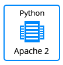
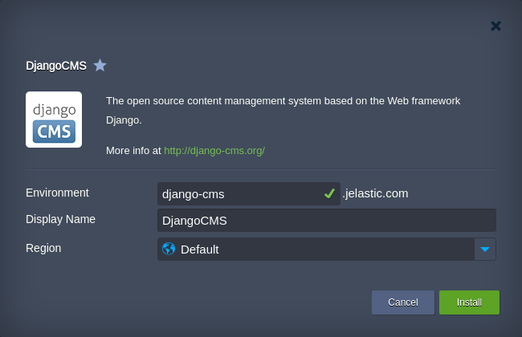

 

## Django Full Stack Environment

**Django** is a Python open-source framework.

### Environment Topology

The JPS package creates a Python-based environment, which contains a MySQL Server, Apache application server and deploys the Django from the web.   

<table border="0"><tr><td>
  
  </td><td>
<strong>Django Version: 3.0.3</strong>     
<strong>MariaDB Version: 10.14.2</strong>     
<strong>Python Engine: Python 3.8.1</strong>      
  </td></tr></table>

### Deployment to the Cloud

In order to get this solution instantly deployed, click the **Get It Hosted Now** button below, specify the required information within the opened page, choose one of the [Jelastic Public Cloud providers](https://jelastic.cloud) and click **Install**.

TODO: Verify Jelastic Repo Address

**Note**: If you are already registered at Jelastic, you can deploy this cluster by importing the [package manifest raw link](https://raw.githubusercontent.com/jelastic-jps/django/master/manifest.jps) within the dashboard.
TODO: Verify Jelastic Repo Address

In the opened confirmation window at Jelastic dashboard, just specify the environment name and the region if several are available, click **Install** and wait for the process to be automatically completed.

 

More information can be found in the article [Django CMS Installation to the Cloud](https://jelastic.com/blog/django-cms-installation-python-cloud-hosting).
